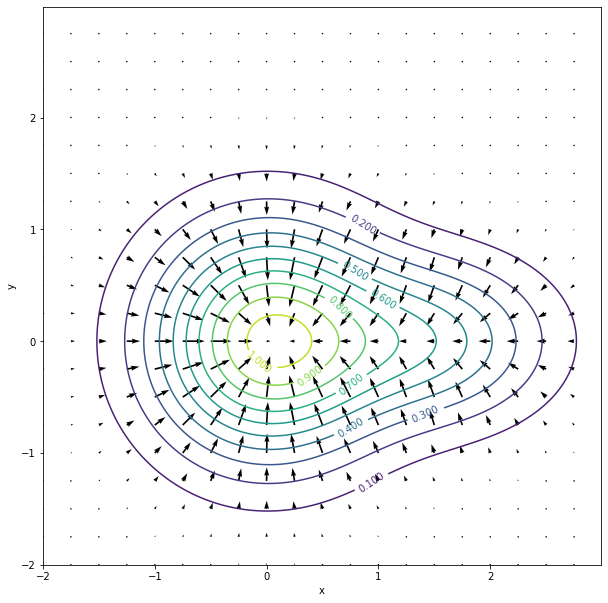

This code creates a contour plot of the gradient of the function, h, and plots it on a grid with arrows pointing perpindicular to the contours. 


```python
import numpy as np
import matplotlib.pyplot as plt

g = np.arange(-2,3,0.01)
[x1,y1] = np.meshgrid(g,g)
h = np.exp(-(x1**2) - y1**2) + 0.5*np.exp(-(x1-1.5)**2 - 2*y1**2) 
plt.figure(3, figsize = (10,14))
ax3 = plt.axes()

hfunction = ax3.contour(x1,y1,h,11)
ax3.clabel(hfunction)

v = np.arange(-2,3,0.25)
[x2,y2] = np.meshgrid(v,v)
U = (-2*x2*np.exp(-x2**2-y2**2)) - ((x2-1.5)*np.exp(-(x2-1.5)**2-(2*y2**2)))
V = (-2*y2*np.exp(-x2**2-y2**2)) - (2*y2*np.exp(-(x2-1.5)**2-(2*y2**2)))
ax3.quiver(x2,y2,U,V, width = 0.003, scale = 22)
      
ax3.set_xlabel('x')
ax3.set_ylabel('y')
ax3.set_aspect('equal')
```


    

    


```python

```
