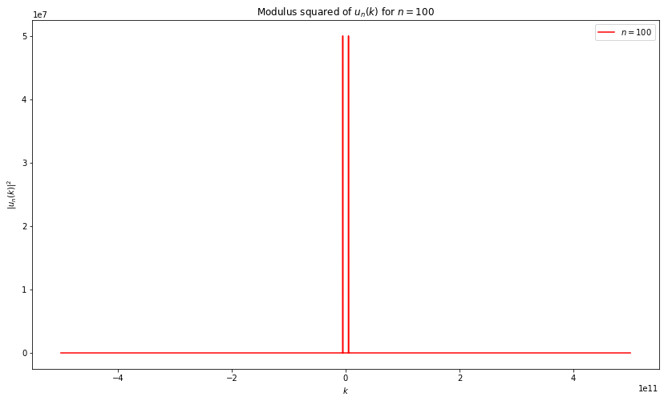

```python
import numpy as np
import matplotlib.pyplot as plt

L = 10e-9
n100 = 100
N = 10000

dx = L / N                                                #Sampling Interval: (xmax - xmin) / N
xvalues = np.linspace(0, (N-1)*dx, N)                     #x-values for the function
dk = 1 / (N*dx)                                           #Spatial Frequency sampling interval

kvalues = np.linspace(0, (N-1)*dk, N)                     #Spatial frequency values for the function
kvalues = kvalues - (N/2)*dk                              #Include negative spatial frequencies as well

u_100 = np.sqrt(2/L)*np.sin(n100*np.pi*xvalues/L)

FourierTransform_100 = np.fft.fft(u_100)/N
FourierTransform_100 = np.fft.fftshift(FourierTransform_100)
MODsqr_100 = np.abs(FourierTransform_100)**2

plt.figure(1, figsize=(14,8))
plt.plot(kvalues, MODsqr_100,'r', label = '$n = 100$')
plt.xlabel('$k$')
plt.ylabel('$|u_n(k)|^2$')
plt.legend(loc = 'upper right')
plt.title('Modulus squared of $u_n(k)$ for $n = 100$')
```


    Text(0.5, 1.0, 'Modulus squared of $u_n(k)$ for $n = 100$')


    

    


```python

```
