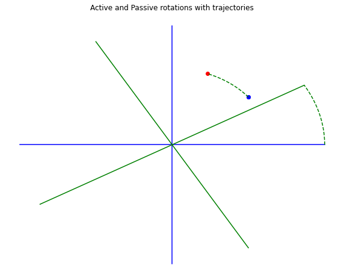

This code explores the action of active and passive rotations on the Euclidean plane. Widgets are imported so that sliders can be defined for the angle of rotation between -180 and 180 degrees. The graph of the rotations is then plotted with the trajectories shown as a dotted line. 


```python
import numpy as np
import matplotlib.pyplot as plt
import ipywidgets as widgets
```


```python
#Active rotation
A = widgets.FloatSlider(min=-180, max=180, step=1, value=30)
display(A)
```


    FloatSlider(value=30.0, max=180.0, min=-180.0, step=1.0)


```python
#Passive rotation
P = widgets.FloatSlider(min=-180, max=180, step=1, value=30)
display(P)
```


    FloatSlider(value=30.0, max=180.0, min=-180.0, step=1.0)


```python
x1 = np.linspace(-1,1,100)
y1 = np.linspace(0,0,100)
x2 = np.linspace(0,0,100)
y2 = np.linspace(-1,1,100)

fig, pas = plt.subplots(figsize=(10,8))
plt.plot(x1, y1, 'b')
plt.plot(x2, y2, 'b')
plt.plot(0.5,0.4, 'ob')
plt.axis('off')
plt.title('Active and Passive rotations with trajectories')
plt.plot(0.5,0.4, 'ob')

#Active Rotation
x = 0.5
y = 0.4
theta_A  = np.radians(A.value)
xprime = (x*np.cos(theta_A)) - (y*np.sin(theta_A))
yprime = (x*np.sin(theta_A)) + (y*np.cos(theta_A))
plt.plot(xprime, yprime, 'or')

AT = np.linspace(0,theta_A,100)
xt = (x*np.cos(AT)) - (y*np.sin(AT))
yt = (x*np.sin(AT)) + (y*np.cos(AT))
plt.plot(xt,yt,'g--')

#Passive Rotation
theta_P = np.radians(P.value)

x1_ = x1*np.cos(theta_P) - y1*np.sin(theta_P)
y1_ = x1*np.sin(theta_P) + y1*np.cos(theta_P)
x2_ = x2*np.cos(theta_P) - y2*np.sin(theta_P)
y2_ = x2*np.sin(theta_P) + y2*np.cos(theta_P)

plt.plot(x1_,y1_,'g')
plt.plot(x2_,y2_,'g')

a = 1
b = 0
PT = np.linspace(0,theta_P,100)
at = (a*np.cos(PT)) - (b*np.sin(PT))
bt = (a*np.sin(PT)) + (b*np.cos(PT))
plt.plot(at,bt,'g--')

```


    [<matplotlib.lines.Line2D at 0x22105ab59d0>]


    

    


```python

```


```python

```
